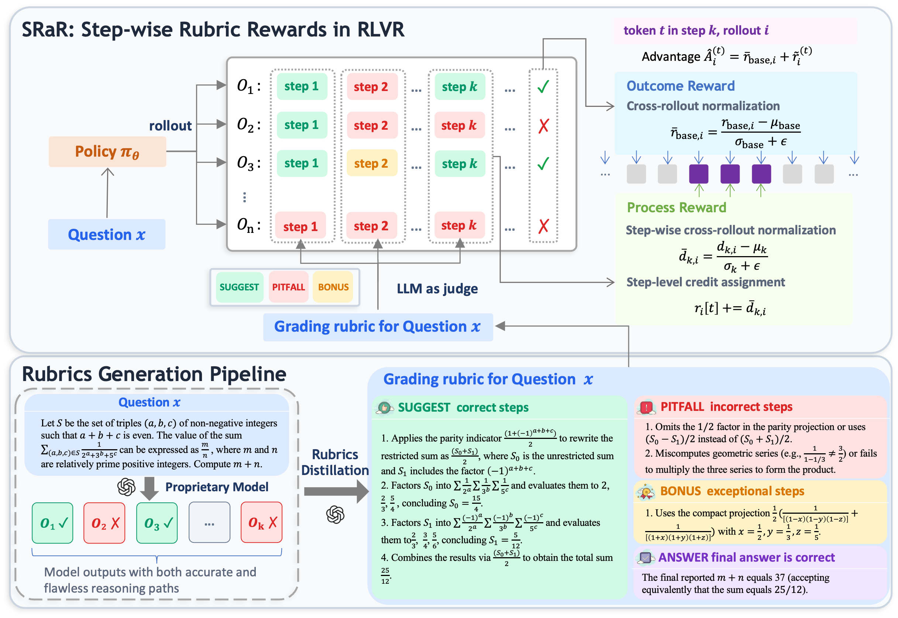

# SRaR: Step-wise Rubric Rewards for LLM Reasoning

<p align="center">
  <a href="https://arxiv.org/abs/2605.17291"></a>&nbsp;
  <a href="https://huggingface.co/collections/akarinmoe/srar"></a>&nbsp;
  <a href="https://github.com/akarinmoe/SRaR"></a>
</p>

This repository contains the official implementation of **SRaR (Step-wise Rubrics as Rewards)**, an RLVR framework that delivers fine-grained, step-level rubric supervision during reinforcement learning training for LLM reasoning.

<p align="center">
  
</p>

## Overview

Reinforcement Learning with Verifiable Rewards (RLVR) trains reasoning LLMs using only final-answer correctness, providing no supervision over intermediate reasoning steps. Rubric-based methods like **RaR** introduce finer-grained evaluation, but still aggregate rubric scores into a single trajectory-level scalar, leading to three structural weaknesses: loss of multi-criterion structure, indiscriminate step supervision (18.2% wrong steps positively rewarded, 49.9% correct steps penalized), and reward hacking via self-correction looping.

**SRaR** addresses these through three coordinated designs:

- **Step-attributed rubric judging**: An LLM judge ties each rubric item (SUGGEST / PITFALL / BONUS) to the specific reasoning step it evaluates.
- **Per-step cross-rollout normalization**: Each step's reward is normalized across rollouts so only steps whose quality varies produce a learning signal.
- **Decoupled advantage estimator**: Outcome advantage + bounded per-step rubric offset, preventing rubric noise from entering the GRPO baseline.

## Installation

```bash
git clone <repo_url>
cd verl
pip install -e .
```

## Data Preparation

```bash
# Preprocess training data (adds step-format prompt, converts to verl format)
python recipe/SRaR/preprocess_data.py --mode train --input /path/to/rubric_data.parquet --output recipe/SRaR/data/train.parquet

# Preprocess validation data
python recipe/SRaR/preprocess_data.py --mode val --input /path/to/val_data.parquet --output recipe/SRaR/data/val.parquet
```

Training data requires columns: `problem`, `rubric`, `ground_truth`. The rubric column contains lines like:
```
<SUGGEST> Applies the parity indicator to rewrite the restricted sum.
<PITFALL> Omits the 1/2 factor in the parity projection.
<BONUS> Uses the compact GF projection form.
<ANSWER> The final reported m+n equals 37.
```

## Training

### SRaR

```bash
ray stop --force || true
ray start --head --num-gpus=8 --dashboard-host=0.0.0.0
export HOME=/path/to/your/home
cd verl && bash recipe/SRaR/run_srar.sh
```

### RaR

```bash
ray stop --force || true
ray start --head --num-gpus=8 --dashboard-host=0.0.0.0
export HOME=/path/to/your/home
cd verl && bash recipe/SRaR/run_rar.sh
```

### Key Hyperparameters

| Hyperparameter | Value |
|:--|:--:|
| Train Batch Size | 128 |
| Rollout Group Size (n) | 8 |
| Learning Rate | 1e-6 |
| Training Steps | 200 |
| Max Response Length | 8192 |
| Clip Ratio High | 0.28 |
| R_SUG / R_PIT / R_BON | 0.8 / -1.0 / 1.0 |
| Format Weight (lambda) | 0.1 |

An OpenAI-compatible LLM judge service is required. Set `JUDGE_URL` and `JUDGE_MODEL` in the run script.

## Project Structure

```
recipe/SRaR/
  reward_manager.py         # RaR/SRaR reward managers with LLM judge
  srar_advantage.py         # Decoupled advantage estimator (SRaR) + GRPO (RaR)
  srar_ray_trainer.py       # Ray trainer
  main_srar.py / main_rar.py
  preprocess_data.py
  run_srar.sh / run_rar.sh
  config/                   # Hydra configs
```

## Citation

```bibtex
@misc{xie2026stepwiserubricrewardsllm,
      title={Step-wise Rubric Rewards for LLM Reasoning}, 
      author={Weichu Xie and Haozhe Zhao and Wenpu Liu and Yongfu Zhu and Liang Chen and Minghao Ye and Zirong Chen and Yuqi Xu and Shuai Dong and Ziyue Wang and Xinbo Xu and Kean Shi and Ruoyu Wu and Xiaoying Zhang and Wenqi Shao and Baobao Chang and Nan Duan and Jiaqi Wang},
      year={2026},
      eprint={2605.17291},
      archivePrefix={arXiv},
      primaryClass={cs.LG},
      url={https://arxiv.org/abs/2605.17291}, 
}
```

## Acknowledgements

Built on [verl](https://github.com/volcengine/verl) and adapted from the [DAPO](https://github.com/volcengine/verl/tree/main/recipe/dapo) training recipe.
